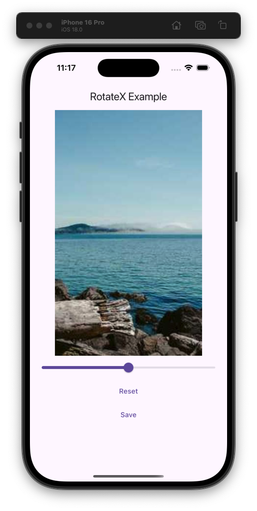
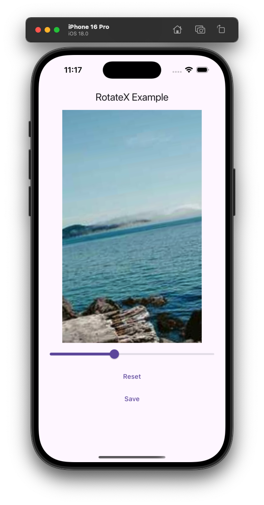

# RotateX (rotate_x)

We just need a package that allows us to rotate an image.

|                 Example1                 |                 Example2                 |
| :--------------------------------------: | :--------------------------------------: |
|  |  |

### Features

- Smooth image rotation with angle control
- Optional scale adjustment during rotation to maintain visibility
- Built-in controller for external rotation control
- Image capture/export capability

### Example

```dart
// Import package
import 'package:rotate_x/rotate_x.dart';

...

RotateXController controller = RotateXController();

...

RotateX(
    controller: controller,
    image: Image.network(
        'https://picsum.photos/300/500',
    ),
    scaleFollowsRotation: true,
),
// This is an example of how to use the controller to rotate the image
Slider(
    value: sliderValue,
    onChanged: (value) {
        setState(() {
            controller.angle = (value * 0.5 * pi) - (pi / 4); // THIS IS AN EXAMPLE OF HOW TO USE THE CONTROLLER TO ROTATE THE IMAGE
            sliderValue = value;
        });
    },
),

// if you want to save the image, you can use the `toUint8List` function
TextButton(
    onPressed: controller.save,
    child: const Text('Save'),
)

```
